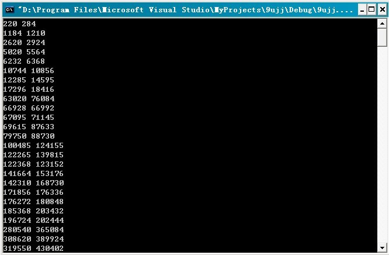
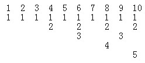

# 第六章：亲和数问题--求解500万以内的亲和数

作者：上善若水、July、yansha


## 题目描述

求500万以内的所有亲和数

如果两个数a和b，a的所有真因数之和等于b,b的所有真因数之和等于a,则称a,b是一对亲和数。
例如220和284，1184和1210，2620和2924。

## 思路分析

  首先得明确到底是什么是亲和数?

亲和数问题最早是由毕达哥拉斯学派发现和研究的。他们在研究数字的规律的时候发现有以下性质特点的两个数:

220的真因子是：1、2、4、5、10、11、20、22、44、55、110；

284的真因子是：1、2、4、71、142。

而这两个数恰恰等于对方的真因子各自加起来的和（sum[i]表示数i 的各个真因子的和），即

220=1+2+4+71+142=sum[284],

284=1+2+4+5+10+11+20+22+44+55+110=sum[220]。

得284的真因子之和sum[284]=220，且220的真因子之和sum[220]=284，即有sum[220]=sum[sum[284]]=284。

如此，是否已看出丝毫端倪?

如上所示，考虑到1是每个整数的因子，把出去整数本身之外的所有因子叫做这个数的“真因子”。如果两个整数，其中每一个真因子的和都恰好等于另一个数，那么这两个数，就构成一对“亲和数”（有关亲和数的更多讨论，可参考[这里](http://t.cn/hesH09))。


**求解**:
    了解了什么是亲和数，接下来咱们一步一步来解决上面提出的问题（以下内容大部引自水的原话，同时水哥有一句原话，**“在你真正弄弄懂这个范例之前，你不配说你懂数据结构和算法”**）。

1. 看到这个问题后，第一想法是什么？模拟搜索+剪枝？回溯？时间复杂度有多大？其中bn为an的伪亲和数，即bn是an的真因数之和大约是多少？至少是10^10的数量级。那么对于每秒千万次运算的计算机来说，大概在1000多天也就是3年内就可以搞定了（10^10 / 10^7 =1000000秒，大约 278 小时）。如果是基于这个基数在优化，你无法在一天内得到结果的。
2. 一个不错的算法应该在半小时之内搞定这个问题，当然这样的算法有很多。节约时间的做法是可以生成伴随数组，也就是空间换时间，但是那样，空间代价太大，因为数据规模庞大。
3. 在稍后的算法中，依然使用的伴随数组，只不过，因为题目的特殊性，只是它方便和巧妙地利用了下标作为伴随数组，来节约时间。同时，将回溯的思想换成递推的思想(预处理数组的时间复杂度为**O(N\*logN)**(logN为调和级数)，扫描数组的时间复杂度为线性**O(N)**。所以，总的时间复杂度为**O(N\*logN+N)**(其中logN为调和级数))。

## 解法一、伴随数组线性遍历

依据上文的思路分析，可以编写如下代码：
```c
//求解亲和数问题

//第一个for和第二个for循环是logN*N（调和级数）次遍历,第三个for循环扫描O(N)。
//所以总的时间复杂度为 O(N*logN) + O(n) =O(N*logN+N)（其中logN为调和级数）。

//关于第一个for和第二个for寻找中，调和级数的说明：
//比如给2的倍数加2，那么应该是  n/2次，3的倍数加3 应该是 n/3次，...
//那么其实就是n*（1+1/2+1/3+1/4+...1/(n/2)）=n*（调和级数）=n*logn。

//copyright@ 上善若水
//July、updated，2011.05.24。
#include<stdio.h>

int sum[5000010];   //为防越界

int main()
{
    int i, j;
    for (i = 0; i <= 5000000; i++)
        sum[i] = 1;  //1是所有数的真因数所以全部置1

    for (i = 2; i + i <= 5000000; i++)  //预处理，预处理是logN（调和级数）*N。
        //@litaoye：调和级数1/2 + 1/3 + 1/4......的和近似为ln(n)，
        //因此O(n *(1/2 + 1/3 + 1/4......)) = O(n * ln(n)) = O(N*log(N))。
    {
        //5000000以下最大的真因数是不超过它的一半的
        j = i + i;  //因为真因数，所以不能算本身，所以从它的2倍开始
        while (j <= 5000000)
        {
            //将所有i的倍数的位置上加i
            sum[j] += i;
            j += i;
        }
    }

    for (i = 220; i <= 5000000; i++)   //扫描，O（N）。
    {
        // 一次遍历，因为知道最小是220和284因此从220开始
        if (sum[i] > i && sum[i] <= 5000000 && sum[sum[i]] == i)
        {
            //去重，不越界，满足亲和
            printf("%d %d/n",i,sum[i]);
        }
    }
    return 0;
}
```
**运行结果**:


>   @上善若水：
>
>   1、可能大家理解的还不是很清晰，我们建立一个5 000 000 的数组，从1到2 500 000开始，在每一个下标是i的倍数的位置上加上i，那么在循环结束之后，我们得到的是什么？是类似埃斯托拉晒求素数的数组（当然里面有真的亲和数），然后只需要一次遍历就可以轻松找到所有的亲和数了。时间复杂度，线性。

>   2、我们可以清晰的发现连续数据的映射可以通过数组结构本身的特点替代，用来节约空间，这是数据结构的艺术。在大规模连续数据的回溯处理上，可以通过转化为递推生成的方法，逆向思维操作，这是算法的艺术。

>   3、把最简单的东西运用的最巧妙的人，要比用复杂方法解决复杂问题的人要头脑清晰。


### 解法一的构造与解释

我再来具体解释下上述程序的原理，ok，举个例子，假设是求10以内的亲和数，求解步骤如下：

因为所有数的真因数都包含1，所以，先在各个数的下方全部置1

1\. 然后取i=2,3,4,5（i<=10/2），j依次对应的位置为j=（4、6、8、10），（6、9）,（8）,（10）各数所对应的位置。依据j所找到的位置，在j所指的各个数的下面加上各个真因子i（i=2、3、4、5）。

2\. 整个过程，即如下图所示（如sum[6]=1+2+3=6，sum[10]=1+2+5=8.）:



3\. 然后一次遍历i从220开始到5000000，i每遍历一个数后,
将i对应的数下面的各个真因子加起来得到一个和sum[i]，如果这个和sum[i]==某个i’，且sum[i‘]=i，
那么这两个数i和i’，即为一对亲和数。

4\. i=2；sum[4]+=2，sum[6]+=2，sum[8]+=2，sum[10]+=2，sum[12]+=2...
i=3，sum[6]+=3，sum[9]+=3...

5\. i=220时，sum[220]=284，i=284时，sum[284]=220；即sum[220]=sum[sum[284]]=284，
得出220与284是一对亲和数。所以，最终输出220、284，...

## 解法二

>litaoye专门为本亲和数问题开帖子继续阐述，有兴趣的朋友可继续参见[这里](http://topic.csdn.net/u/20110526/21/129c2235-1f44-42e9-a55f-878920c21e19.html)。同时，任何人对本亲和数问题有任何问题，也可以回复到上述帖子上。

```csharp
//求解亲和数问题
//copyright@ litaoye
//July、胡滨，updated，2011.05.26。
using System;
using System.Collections.Generic;

namespace CSharpTest
{
    class Program
    {
        public static void Main()
        {
            int max = 5000000;
            DateTime start = DateTime.Now;
            int[] counter = CreateCounter(max);

            for (int i = 0; i < counter.Length; i++)
            {
                int num = counter[i] - i;
                if (num < counter.Length && num > i && counter[num] == counter[i])
                    Console.WriteLine("{0} {1}", i, num);
            }
            Console.WriteLine((DateTime.Now - start).TotalSeconds);

            Console.ReadKey();
        }

        static int[] CreateCounter(int n)
        {
            List<int> primes = new List<int>();
            int[] counter = new int[n + 1];
            counter[1] = 1;

            for (int i = 2; i <= n; i++)
            {
                if (counter[i] == 0)
                {
                    counter[i] = i + 1;
                    primes.Add(i);
                }

                for (int j = 0; j < primes.Count; j++)
                {
                    if (primes[j] * i > n)
                        break;

                    if (i % primes[j] == 0)
                    {
                        int k = i;
                        int l = primes[j] * primes[j];

                        while (k % primes[j] == 0)
                        {
                            l *= primes[j];
                            k /= primes[j];
                        }

                        counter[primes[j] * i] = counter[k] * (l - 1) / (primes[j] - 1);
                        break;
                    }
                    else
                        counter[primes[j] * i] = counter[i] * (primes[j] + 1);
                }
            }

            return counter;
        }
    }
}

/*
测试结果：
0.484375
0.484375
0.46875
单位second。
*/
```
