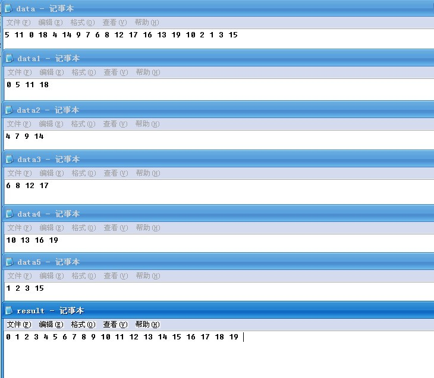
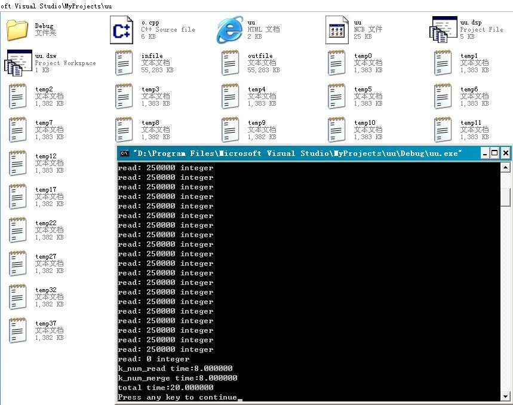

# 第十章：如何给10^7个数据量的磁盘文件排序

作者:July，yansha，5，编程艺术室。

## 前奏

经过几天的痛苦沉思，最终决定，把原程序员面试题狂想曲系列正式更名为程序员编程艺术系列，同时，狂想曲创作组更名为编程艺术室。之所以要改名，我们考虑到三点：1、为面试服务不能成为我们最终或最主要的目的，2、我更愿把解答一道道面试题，ACM题等各类程序设计题目的过程，当做一种艺术来看待，3、艺术的提炼本身是一个非常非常艰难的过程，但我们乐意接受这个挑战。

ok，如果任何人对本编程艺术系列有任何意见，或发现了本编程艺术系列任何问题，漏洞，bug，欢迎随时提出，我们将虚心接受并感激不尽，以为他人创造更好的价值，更好的服务。

## 第一节、如何给磁盘文件排序
问题描述：
输入：给定一个文件，里面最多含有n个不重复的正整数（也就是说可能含有少于n个不重复正整数），且其中每个数都小于等于n，n=10^7。
输出：得到按从小到大升序排列的包含所有输入的整数的列表。
条件：最多有大约1MB的内存空间可用，但磁盘空间足够。且要求运行时间在5分钟以下，10秒为最佳结果。


###解法一、归并排序

你可能会想到把磁盘文件进行归并排序，但题目要求你只有1MB的内存空间可用，所以，归并排序这个方法不行。

###解法二、位图方案

熟悉位图的朋友可能会想到用位图来表示这个文件集合。例如正如编程珠玑一书上所述，用一个20位长的字符串来表示一个所有元素都小于20的简单的非负整数集合，边框用如下字符串来表示集合{1,2,3,5,8,13}：

    0 1 1 1 0 1 0 0 1 0 0 0 0 1 0 0 0 0 0 0

上述集合中各数对应的位置则置1，没有对应的数的位置则置0。

参考编程珠玑一书上的位图方案，针对我们的10^7个数据量的磁盘文件排序问题，我们可以这么考虑，由于每个7位十进制整数表示一个小于1000万的整数。我们可以使用一个具有1000万个位的字符串来表示这个文件，其中，当且仅当整数i在文件中存在时，第i位为1。采取这个位图的方案是因为我们面对的这个问题的特殊性：

1. 输入数据限制在相对较小的范围内，
2. 数据没有重复，
3. 其中的每条记录都是单一的整数，没有任何其它与之关联的数据。

所以，此问题用位图的方案分为以下三步进行解决：

* 第一步，将所有的位都置为0，从而将集合初始化为空。
* 第二步，通过读入文件中的每个整数来建立集合，将每个对应的位都置为1。
* 第三步，检验每一位，如果该位为1，就输出对应的整数。

经过以上三步后，产生有序的输出文件。令n为位图向量中的位数（本例中为1000 0000），程序可以用伪代码表示如下：
    
    //磁盘文件排序位图方案的伪代码  
    //copyright@ Jon Bentley  
    //July、updated，2011.05.29。  
      
    //第一步，将所有的位都初始化为0  
    for i ={0,....n}      
       bit[i]=0;  
    //第二步，通过读入文件中的每个整数来建立集合，将每个对应的位都置为1。  
    for each i in the input file     
       bit[i]=1;  
      
    //第三步，检验每一位，如果该位为1，就输出对应的整数。  
    for i={0...n}      
      if bit[i]==1        
        write i on the output file  

上述的位图方案，共需要扫描输入数据两次，具体执行步骤如下：

第一次，只处理1—4999999之间的数据，这些数都是小于5000000的，对这些数进行位图排序，只需要约5000000/8=625000Byte，也就是0.625M，排序后输出。
第二次，扫描输入文件时，只处理4999999-10000000的数据项，也只需要0.625M（可以使用第一次处理申请的内存）。
因此，总共也只需要0.625M
位图的的方法有必要强调一下，就是位图的适用范围为针对不重复的数据进行排序，若数据有重复，位图方案就不适用了。

不过很快，我们就将意识到，用此位图方法，严格说来还是不太行，空间消耗10^7/8还是大于1M（1M=1024*1024空间，小于10^7/8）。

既然如果用位图方案的话，我们需要约1.25MB（若每条记录是8位的正整数的话，则10000000/(1024*1024*8) ~= 1.2M）的空间，而现在只有1MB的可用存储空间，那么究竟该作何处理呢？

###解法三、多路归并

诚然，在面对本题时，还可以通过计算分析出可以用如2的位图法解决，但实际上，很多的时候，我们都面临着这样一个问题，文件太大，无法一次性放入内存中计算处理，那这个时候咋办呢？分而治之，大而化小，也就是把整个大文件分为若干大小的几块，然后分别对每一块进行排序，最后完成整个过程的排序。k趟算法可以在kn的时间开销内和n/k的空间开销内完成对最多n个小于n的无重复正整数的排序。

比如可分为2块（k=2，1趟反正占用的内存只有1.25/2M），1~4999999，和5000000~9999999。先遍历一趟，首先排序处理1~4999999之间的整数（用5000000/8=625000个字的存储空间来排序0~4999999之间的整数），然后再第二趟，对5000001~1000000之间的整数进行排序处理。

我们下面针对20个小数据的文件举例说明，每趟对4个数据进行排序，即5路归并，程序的排序结果如下图所示。



运行时间：

0ms，可以忽略不计了，毕竟是对20个数的小数据量进行排序：


沙海拾贝：

我们不在乎是否能把一个软件产品或一本书最终完成，我们更在乎的是，在完成这个产品或创作这本书的过程中，读者学到了什么，能学到什么?所以，不要一味的马上就想得到一道题目的正确答案，请跟着我们一起逐步走向山巅。

##多路归并算法的C实现

    
```cpp
//copyright@ 555  
//July、2011.05.29。  
#include <assert.h>
#include <time.h>
#include <stdio.h>
#include <memory.h>
#include <stdlib.h>

void swap_int(int* a,int* b)
{
    int c;
    c = *a;
    *a = *b;
    *b = c;
}

//插入排序  
void InsertionSort(int A[],int N)
{
    int j,p;
    int tmp;
    for(p = 1; p < N; p++)
    {
        tmp = A[p];
        for(j = p;j > 0 && A[j - 1] >tmp;j--)
        {
            A[j] = A[j - 1];
        }

        A[j] = tmp;
    }
}

//三数取中分割法  
int Median3(int A[],int Left,int Right)
{
    int Center = (Left + Right) / 2;
    if (A[Left] > A[Center])
        swap_int(&A[Left],&A[Center]);
    if (A[Left] > A[Right])
        swap_int(&A[Left],&A[Right]);
    if (A[Center] > A[Right])
        swap_int(&A[Center],&A[Right]);
    swap_int(&A[Center],&A[Right - 1]);
    return A[Right - 1];
}

//快速排序  
void QuickSort(int A[],int Left,int Right)
{
    int i,j;
    int Pivot;
    const int Cutoff = 3;
    if (Left + Cutoff <= Right)
    {
        Pivot = Median3(A,Left,Right);
        i = Left;
        j = Right - 1;
        while (1)
        {
            while(A[++i] < Pivot){;}
            while(A[--j] > Pivot){;}
            if (i < j)
                swap_int(&A[i],&A[j]);
            else
                break;
        }
        swap_int(&A[i],&A[Right - 1]);

        QuickSort(A,Left,i - 1);
        QuickSort(A,i + 1,Right);
    }
    else
    {
        InsertionSort(A+Left,Right - Left + 1);
    }
}

//const int  KNUM  = 40;
//分块数
const int  NUMBER = 10000000;
//输入文件最大读取的整数的个数
//为了便于测试，我决定改成小文件小数据量进行测试。
const int  KNUM  = 4;
//分块数const int  NUMBER = 100;
//输入文件最大读取的整数的个数
const char *in_file = "infile.txt";
const char *out_file = "outfile.txt";
//#define OUTPUT_OUT_FILE_DATA
//数据量大的时候,没必要把所有的数全部打印出来，所以可以把上面这句注释掉。
void  gen_infile(int n)
{
    int i;
    FILE *f = fopen(in_file, "wt");
    for(i = 0;i < n; i++)
        fprintf(f,"%d ",rand());
    fclose(f);
}

int  read_data(FILE *f,int a[],int n)
{
    int i = 0;
    while ((i < n) && (fscanf(f,"%d",&a[i]) != EOF))
        i++;
    printf("read: %d integer/n",i);
    return i;
}

void  write_data(FILE *f,int a[],int n)  
{
    int i;for(i = 0; i< n;i++)
        fprintf(f,"%d ",a[i]);
}

char* temp_filename(int index)
{
    char *tempfile = (char*) malloc(64*sizeof(char));
    assert(tempfile);
    sprintf(tempfile, "temp%d.txt", index);
    return tempfile;
}

//K路串行读取
void k_num_read(void)
{
    char* filename;
    int i,cnt,*array;
    FILE* fin;
    FILE* tmpfile;
    //计算knum,每路应读取的整数个数int n = NUMBER/KNUM;
    if (n * KNUM < NUMBER)n++;

    //建立存储分块读取的数据的数组
    array = (int*)malloc(n * sizeof(int));assert(array);
    //打开输入文件
    fin = fopen(in_file,"rt");
    i = 0;

    //分块循环读取数据,并写入硬盘上的临时文件
    while ( (cnt = read_data(fin,array,n))>0)
    {
        //对每次读取的数据,先进行快速排序,然后写入硬盘上的临时文件
        QuickSort(array,0,cnt - 1);
        filename = temp_filename(i++);
        tmpfile = fopen(filename,"w");
        free(filename);
        write_data(tmpfile,array,cnt);
        fclose(tmpfile);
    }
    assert(i == KNUM);
    //没有生成K路文件时进行诊断
    //关闭输入文件句柄和临时存储数组
    fclose(fin);
    free(array);
}

//k路合并(败者树)
void k_num_merge(void)
{
    FILE *fout;
    FILE **farray;
    char *filename;
    int  *data;
    char *hasNext;
    int i,j,m,min;
    #ifdef OUTPUT_OUT_FILE_DATAint id;
    #endif
    //打开输出文件
    fout = fopen(out_file,"wt");
    //打开各路临时分块文件
    farray = (FILE**)malloc(KNUM*sizeof(FILE*));
    assert(farray);
    for(i = 0; i< KNUM;i++)
    {
        filename = temp_filename(i);
        farray[i] = fopen(filename,"rt");
        free(filename);
    }

    //建立KNUM个元素的data,hasNext数组,存储K路文件的临时数组和读取结束状态
    data = (int*)malloc(KNUM*sizeof(int));
    assert(data);
    hasNext = (char*)malloc(sizeof(char)*KNUM);
    assert(hasNext);
    memset(data, 0, sizeof(int) * KNUM);
    memset(hasNext, 1, sizeof(char) * KNUM);

    //读K路文件先读取第一组数据,并对读取结束的各路文件设置不可再读状态
    for(i = 0; i < KNUM; i++)
    {
        if(fscanf(farray[i], "%d", &data[i]) == EOF)
        {
            hasNext[i] = 0;
        }
    }
  
    //读取各路文件,利用败者树从小到大输出到输出文件
    #ifdef OUTPUT_OUT_FILE_DATAid = 0;
    #endif
  
    j  = 0;F_LOOP:
    if (j < KNUM)
        //以下这段代码嵌套过深，日后应尽量避免此类问题。
    {
        while(1==1)
        {
            min = data[j];
            m = j;
            for(i = j+1; i < KNUM; i++)
            {
                if(hasNext[i] == 1  && min > data[i])
                {
                    min = data[i];m = i;
                }
            }

            if(fscanf(farray[m], "%d", &data[m]) == EOF)
            {
                hasNext[m] = 0;
            }
            fprintf(fout, "%d ", min);
#ifdef OUTPUT_OUT_FILE_DATAprintf("fout :%d  %d/n",++id,min);  
#endif  
            if (m == j && hasNext[m] == 0)
            {  
                for (i = j+1; i < KNUM; i++)
                {  
                    if (hasNext[m] != hasNext[i])
                    {
                        m = i;
                        //第i个文件未读完,从第i个继续往下读
                        break;
                    }
                }
                if (m != j)
                {
                    j = m;
                    goto F_LOOP;
                }
                break;
            }  
        }  
    }  
  
    //关闭分配的数据和数组
    free(hasNext);
    free(data);
    for(i = 0; i < KNUM; ++i)
    {
        fclose(farray[i]);
    }
    free(farray);
    fclose(fout);
}

int main()
{
    time_t start = time(NULL),end,start_read,end_read,start_merge,end_merge;
    gen_infile(NUMBER);
    end = time(NULL);
    printf("gen_infile data time:%f/n", (end - start) * 1000.0/ CLOCKS_PER_SEC);
    start_read = time(NULL);k_num_read();
    end_read = time(NULL);
    printf("k_num_read time:%f/n", (end_read - start_read) * 1000.0/ CLOCKS_PER_SEC);
    start_merge = time(NULL);
    k_num_merge();
    end_merge = time(NULL);
    printf("k_num_merge time:%f/n", (end_merge - start_merge) * 1000.0/ CLOCKS_PER_SEC);
    end = time(NULL);
    printf("total time:%f/n", (end - start) * 1000.0/ CLOCKS_PER_SEC);
    return 0;
}
```

程序测试：

在此，我们先测试下对10000000个数据的文件进行40趟排序，然后再对100个数据的文件进行4趟排序（读者可进一步测试）。如弄几组小点的数据,输出ID和数据到屏幕，再看程序运行效果。

1. 10个数, 4组
2. 40个数, 5组
3. 55个数, 6组
4. 100个数, 7组




（备注：1、以上所有各节的程序运行环境为windows xp + vc6.0 + e5200 cpu 2.5g主频，2、感谢5为本文程序所作的大量测试工作）

####全文总结：

1、关于本章中位图和多路归并两种方案的时间复杂度及空间复杂度的比较，如下：

              时间复杂度       空间复杂度
  位图         O(N)           0.625M
  多位归并   O(Nlogn)         1M

（多路归并，时间复杂度为O（k*n/k*logn/k ），严格来说，还要加上读写磁盘的时间，而此算法绝大部分时间也是浪费在这上面）

2、bit-map

适用范围：可进行数据的快速查找，判重，删除，一般来说数据范围是int的10倍以下
基本原理及要点：使用bit数组来表示某些元素是否存在，比如8位电话号码
扩展：bloom filter可以看做是对bit-map的扩展

问题实例：

1)已知某个文件内包含一些电话号码，每个号码为8位数字，统计不同号码的个数。
8位最多99 999 999，大概需要99m个bit，大概10几m字节的内存即可。

2)2.5亿个整数中找出不重复的整数的个数，内存空间不足以容纳这2.5亿个整数。

将bit-map扩展一下，用2bit表示一个数即可，0表示未出现，1表示出现一次，2表示出现2次及以上。或者我们不用2bit来进行表示，我们用两个bit-map即可模拟实现这个2bit-map。

3、[外排序适用范围]大数据的排序，去重基本原理及要点：外排序的归并方法，置换选择败者树原理，最优归并树扩展。问题实例：1).有一个1G大小的一个文件，里面每一行是一个词，词的大小不超过16个字节，内存限制大小是1M。返回频数最高的100个词。这个数据具有很明显的特点，词的大小为16个字节，但是内存只有1m做hash有些不够，所以可以用来排序。内存可以当输入缓冲区使用。 
