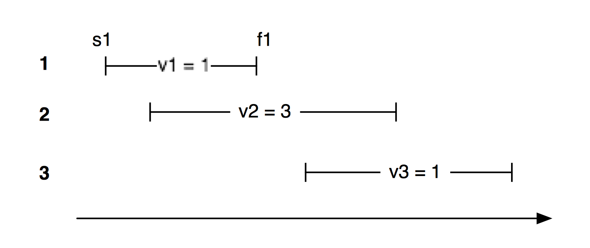

# 第四十三章：加权区间调度

作者: [wihoho](https://github.com/wihoho)
时间：2014/2/21

##题记

可能大家对这个标题很是奇怪，但我也不知道到底如何更好的翻译，对应准确的英文是 `Weighted Interval Scheduling`。个人觉得这是一个dynamic programing相关并且相对容易的问题，LCS都需要 2-D 数组，而这个只需要 1-D 数组。

## 题目描述
给定一组时间间隔$$(s_i, f_i)$$ 每一个时间间隔的价值为$v_i$$$,现在需要找到这组时间的子集$$S$$使得 $$\sum_{i \in S}^{i} v_i$$最大，并且这个子集的所有间隔都不相交。

举一个简单的例子，如下图所示


那么对于这个例子，正确答案是只选择`v2`，最大的价值为3。

### 解法一

既然已经知道需要使用动态规划，那么我们需要做的就是找到相关的公式。在此之前，让我们先定义几个变量。

$$OPT(j)$$: 当只有从`1,2...j`个时间间隔时的最优解
$$p(j)$$: 第j个时间间隔左边的第一个不跟它相交的时间间隔的位置
$$v_j$$:第j个时间间隔的价值

现在我们就进入到正确的解法当中，需要进行以下几步：

1. 根据每个时间间隔的结束时间来对所有的时间间隔进行排序
2. 动态规划的公式如下 $$OPT(j) = max(v_j + OPT(p(j)), OPT(j-1))$$
3. OPT这个数组的最后一个值为最优解

相对来说，还是比较好理解的，对于第j个时间间隔而言，我们会有2个选择：

1. 把第j个时间间隔加到子集S当中去，那么$$OPT(j) = v_j + OPT(p(j))$$
2. 不加第j个时间间隔，此时$$OPT(j) = OPT(j-1)$$

### 代码一

```
 public int getMaxWorkingTime(List<Interval> intervals) {

        if (intervals == null || intervals.size() == 0)
            return 0;
        
        int numberOfInterval = intervals.size();
        Interval[] arrayOfIntervals = new Interval[numberOfInterval];
        for(int i = 0; i < numberOfInterval; i ++){
            if (intervals.get(i) == null)
                throw new IllegalArgumentException("The argument (a list of intervals) must not contain null!");

            arrayOfIntervals[i] = intervals.get(i);
        }

        // Sort these intervals according to their finishing time
        Arrays.sort(arrayOfIntervals, new Comparator<Interval>() {
            @Override
            public int compare(Interval interval, Interval interval2) {
                return ((Integer)interval.getEndMinuteUnit()).compareTo(interval2.getEndMinuteUnit());
            }
        });

        // Get the array, where each value represents the nearest interval of the current interval without overlapping
        int[] nearestNonOverlappedIndexes = getNearestNonOverlappedInterval(arrayOfIntervals);

        // Cache the optimal value for each index
        int[] longestWorkingTimeSoFar = new int[numberOfInterval];

        longestWorkingTimeSoFar[0] = arrayOfIntervals[0].getIntervalMinute();
        for(int i = 1; i < numberOfInterval; i ++){

            // count the current interval arrayOfIntervals[i]
            int value1 = 0;
            if(nearestNonOverlappedIndexes[i] > -1)
                value1 = arrayOfIntervals[i].getIntervalMinute() + longestWorkingTimeSoFar[nearestNonOverlappedIndexes[i]];
            else
                value1 = arrayOfIntervals[i].getIntervalMinute();

            // do not count the current interval arrayOfIntervals[i]
            int value2 = longestWorkingTimeSoFar[i -1];

            longestWorkingTimeSoFar[i] = Math.max(value1,value2);
        }

        // Return the last value in the array of longestWorkingTimeSoFar as the optimal solution
        return longestWorkingTimeSoFar[numberOfInterval-1];
    }


    /**
     * This method calculates an array of indexes.
     * For instance, the jth value of the returned array indicates the interval which is nearest to jth interval without overlapping.
     *
     * @param intervals a list of sorted intervals according to their finishing time
     * @return an array of indexes
     */
    public int[] getNearestNonOverlappedInterval(Interval[] intervals){
        if(intervals == null || intervals.length == 0)
            throw new IllegalArgumentException("The argument can not be null or empty!");

        int[] indexTable = new int[intervals.length];
        for(int i = 0; i < intervals.length; i ++){
            Interval interval = intervals[i];

            // Traverses the left side and find the first interval which does  not overlap with intervals[i]
            int j = i - 1;
            for(; j >= 0; j --){
                if(! checkOverlap(interval, intervals[j]))
                    break;
            }

            indexTable[i] = j;
        }

        return indexTable;

    }

    /**
     * Checks whether two intervals overlap with each other or not
     * @param one an interval
     * @param two another interval
     * @return true or false
     */
    public boolean checkOverlap(Interval one, Interval two){
        return one.getBeginMinuteUnit() <= two.getEndMinuteUnit() && two.getBeginMinuteUnit() <= one.getEndMinuteUnit();
    }
}
```

### Reference
[CMU](http://www.cs.cmu.edu/~ckingsf/bioinfo-lectures/dynamicp.pdf)
